# Домашнее задание к занятию "3.6. Компьютерные сети, лекция 1"

1. Работа c HTTP через телнет.  
- Подключитесь утилитой телнет к сайту stackoverflow.com  
`telnet stackoverflow.com 80`  
- отправьте HTTP запрос  
```bash
GET /questions HTTP/1.0
HOST: stackoverflow.com
[press enter]
[press enter]
```
- В ответе укажите полученный HTTP код, что он означает?   
>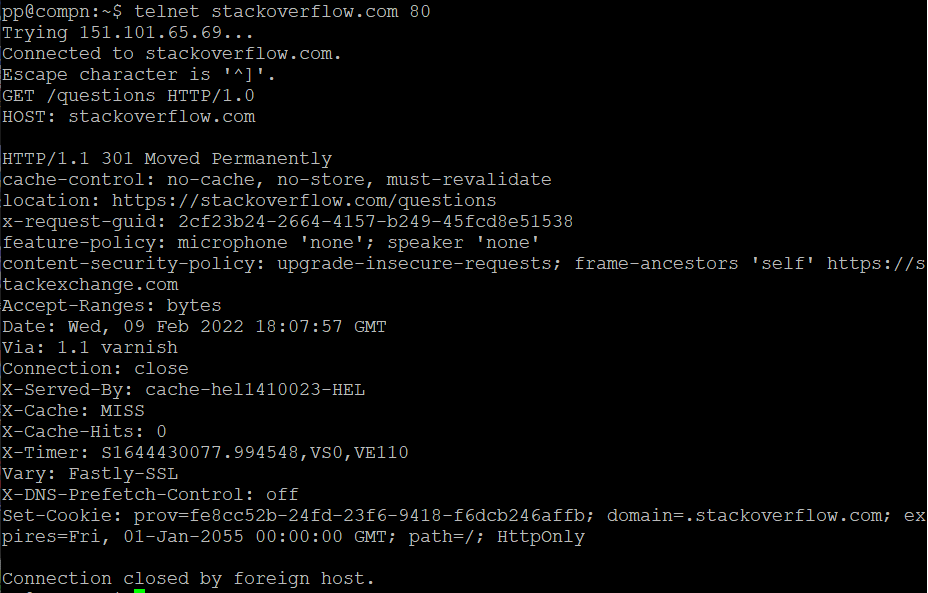
> web сервер ответил кодом 301 имеется ридирект на https://stackoverflow.com/questions 

2. Повторите задание 1 в браузере, используя консоль разработчика F12.  
- откройте вкладку `Network`
- отправьте запрос http://stackoverflow.com
- найдите первый ответ HTTP сервера, откройте вкладку `Headers`
- укажите в ответе полученный HTTP код.
>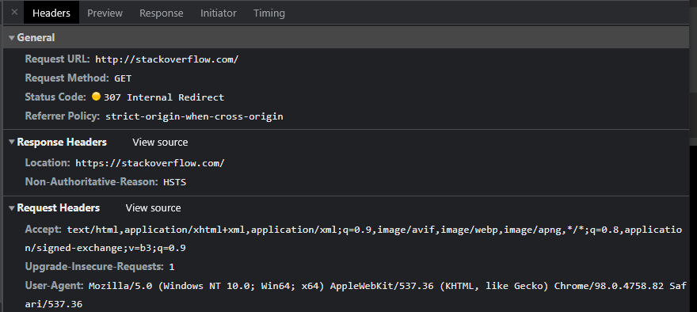
- проверьте время загрузки страницы, какой запрос обрабатывался дольше всего?
- приложите скриншот консоли браузера в ответ.
>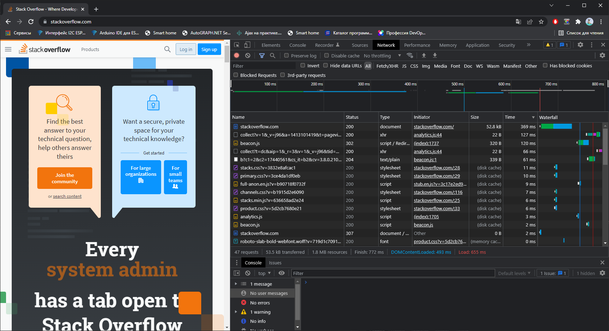
>Дольше всего открывается URL: https://stackoverflow.com/ на моем пк 369мс. (сортировка на скрине по скорости обработки данных.)    
3. Какой IP адрес у вас в интернете?  
>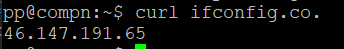  
4. Какому провайдеру принадлежит ваш IP адрес? Какой автономной системе AS? Воспользуйтесь утилитой `whois`    
>  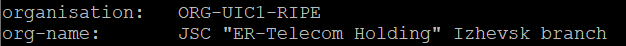
> 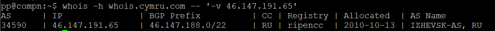
> 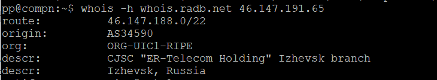
5. Через какие сети проходит пакет, отправленный с вашего компьютера на адрес 8.8.8.8? Через какие AS? Воспользуйтесь утилитой `traceroute`  
>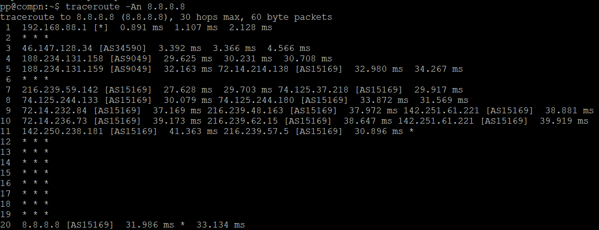  
6. Повторите задание 5 в утилите `mtr`. На каком участке наибольшая задержка - delay?  
>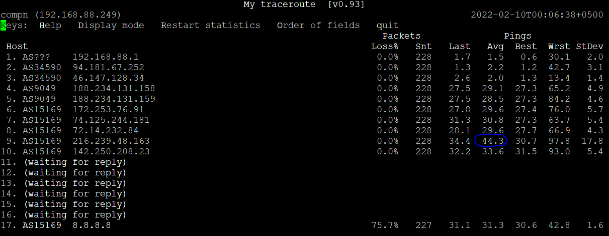  
>Участок со средней задержкой отмечен синим, на нем же зафиксировано максимальное время задержки.  
7. Какие DNS сервера отвечают за доменное имя dns.google? Какие A записи? воспользуйтесь утилитой `dig`  
>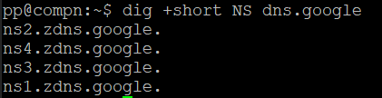    
> 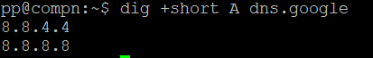    
8. Проверьте PTR записи для IP адресов из задания 7. Какое доменное имя привязано к IP? воспользуйтесь утилитой `dig`  
>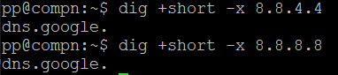